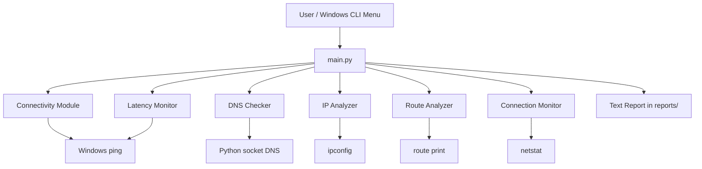

# Architecture Diagram (Mermaid)

```mermaid
flowchart TD
    A[User / Windows CLI Menu] --> B[main.py]
    B --> C[Connectivity Module]
    B --> D[DNS Checker]
    B --> E[Latency Monitor]
    B --> F[IP Analyzer]
    B --> G[Route Analyzer]
    B --> H[Connection Monitor]
    C --> I[Windows ping]
    D --> J[Python socket DNS]
    E --> I
    F --> K[ipconfig]
    G --> L[route print]
    H --> M[netstat]
    B --> N[Text Report in reports/]
```
